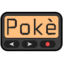

__Warning: Depending on your region, it may not be legal to share or act upon any messages received by a radio scanner. 
You are advised to check your local regulations, and to NOT expose PokéSAG to the internet.__



# PokéSAG (Docker Edition)

A dockerized version of [PokéSAG](https://github.com/JoppyFurr/PokeSAG/) by @JoppyFurr!

To run a full stack of `pokesag-docker` (including a database), you can use the following `docker-compose` file.

```yaml
---
services:
  db:
    image: postgres:15
    container_name: pokesag_db
    environment:
      POSTGRES_USER: pokesag
      POSTGRES_PASSWORD: pokesag
      TZ: Pacific/Auckland
    volumes:
      - pokesag_db:/var/lib/postgresql/data
    restart: always

  receiver:
    image: ghcr.io/dmptrluke/pokesag-receiver:latest
    container_name: pokesag_receiver
    environment:
      TZ: Pacific/Auckland
      # RTL_DEVICE_SERIAL: '00000001'  # Select RTL-SDR by serial number
      # RTL_DEVICE_INDEX: '0'          # Or select by device index
    devices:
      - /dev/bus/usb:/dev/bus/usb
    privileged: true
    restart: always

  web:
    image: ghcr.io/dmptrluke/pokesag-web:latest
    container_name: pokesag_web
    environment:
      TZ: Pacific/Auckland
    ports:
      - "8000:8000"
    restart: always

volumes:
  pokesag_db:
```

You can also choose to use an external database by omitting the `db` container and using the `DB_HOST`/`DB_NAME`/`DB_USER`/`DB_PASS` environment variables on the `web` and `receiver` containers.

## RTL-SDR Device Selection

If you have multiple RTL-SDR dongles connected, you can select which one PokéSAG uses via environment variables on the `receiver` container:

| Variable | Description |
|----------|-------------|
| `RTL_DEVICE_SERIAL` | Select the RTL-SDR device by its serial number (recommended). |
| `RTL_DEVICE_INDEX` | Select the RTL-SDR device by index (0-based). |

If neither is set, the receiver defaults to device index 0.

Using `RTL_DEVICE_SERIAL` is recommended over `RTL_DEVICE_INDEX` because device indices can change across reboots, while serial numbers are stable. You can find your dongle's serial number by running `rtl_test` on the host.

## Step by Step
If you're new to Docker, below is a step by step guide to running PokéSAG in Docker. 

First of all, you'll need to install Docker. Head to the [official documentation](https://docs.docker.com/engine/install/) and select your Linux distro under the "Server" section and follow the instructions on the page.

After that, create a new folder to work in to keep things tidy. In that folder create a file called `docker-compose.yml` with the text in the previous section, and save it. If you just want a basic install of PokéSAG, you won't need to edit anything.

Finally, run `docker compose up` to start PokéSAG! This will run in the foreground. When you're happy with how everything is working, you can use `docker compose up -d` to run everything in the background.

To update to the latest version, just run `docker compose pull` and then `docker compose up -d` again.

## License

This software is released under the MIT license.

```
Copyright (c) 2018 Joppy Furr
Copyright (c) 2020-2026 Luke Rogers

Permission is hereby granted, free of charge, to any person obtaining a copy
of this software and associated documentation files (the "Software"), to deal
in the Software without restriction, including without limitation the rights
to use, copy, modify, merge, publish, distribute, sublicense, and/or sell
copies of the Software, and to permit persons to whom the Software is
furnished to do so, subject to the following conditions:

The above copyright notice and this permission notice shall be included in all
copies or substantial portions of the Software.

THE SOFTWARE IS PROVIDED "AS IS", WITHOUT WARRANTY OF ANY KIND, EXPRESS OR
IMPLIED, INCLUDING BUT NOT LIMITED TO THE WARRANTIES OF MERCHANTABILITY,
FITNESS FOR A PARTICULAR PURPOSE AND NONINFRINGEMENT. IN NO EVENT SHALL THE
AUTHORS OR COPYRIGHT HOLDERS BE LIABLE FOR ANY CLAIM, DAMAGES OR OTHER
LIABILITY, WHETHER IN AN ACTION OF CONTRACT, TORT OR OTHERWISE, ARISING FROM,
OUT OF OR IN CONNECTION WITH THE SOFTWARE OR THE USE OR OTHER DEALINGS IN THE
SOFTWARE.
```
