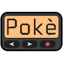

__Warning: Depending on your region, it may not be legal to share or act upon any messages received by a radio scanner. 
You are advised to check your local regulations, and to NOT expose PokéSAG to the internet.__



# PokéSAG (Docker Edition)

A dockerized version of [PokéSAG](https://github.com/JoppyFurr/PokeSAG/) by @JoppyFurr!

To run a full stack of `pokesag-docker` (including a database), you can use the following `docker-compose` file.

```yaml
---
services:
  db:
    image: postgres:15
    container_name: pokesag_db
    environment:
      POSTGRES_USER: pokesag
      POSTGRES_PASSWORD: pokesag
      TZ: Pacific/Auckland
    volumes:
      - pokesag_db:/var/lib/postgresql/data
    restart: always

  receiver:
    image: ghcr.io/dmptrluke/pokesag-receiver:latest
    container_name: pokesag_receiver
    environment:
      TZ: Pacific/Auckland
      # RTL_DEVICE_SERIAL: '00000001'  # Select RTL-SDR by serial number
    devices:
      - /dev/bus/usb:/dev/bus/usb
    device_cgroup_rules:
      - 'c 189:* rwm'
    restart: always
    volumes:
      - ./channels.json:/config/channels.json:ro

  web:
    image: ghcr.io/dmptrluke/pokesag-web:latest
    container_name: pokesag_web
    environment:
      TZ: Pacific/Auckland
    ports:
      - "8000:8000"
    restart: always
    volumes:
      # - ./tooltips.json:/config/tooltips.json:ro

volumes:
  pokesag_db:
```

You can also choose to use an external database by omitting the `db` container and using the `DB_HOST`/`DB_NAME`/`DB_USER`/`DB_PASS` environment variables on the `web` and `receiver` containers.

## Channel Configuration

The receiver requires a `channels.json` file that defines the SDR centre frequency and channels to decode. This file must be mounted into the container at `/config/channels.json`.

Here is an example configuration for typical New Zealand paging frequencies:

```json
{
  "center_freq": 157900000,
  "channels": [
    {
      "name": "NZ 925",
      "offset_hz": 25000,
      "protocols": ["POCSAG512", "POCSAG1200", "FLEX", "FLEX_NEXT"]
    },
    {
      "name": "NZ 950",
      "offset_hz": 50000,
      "protocols": ["POCSAG512", "POCSAG1200", "FLEX", "FLEX_NEXT"]
    },
    {
      "name": "NZ 975",
      "offset_hz": 75000,
      "protocols": ["POCSAG512", "POCSAG1200", "FLEX", "FLEX_NEXT"]
    }
  ]
}
```

| Field | Description |
|-------|-------------|
| `center_freq` | RTL-SDR centre frequency in Hz. |
| `channels[].name` | Display name for the channel (appears in the `source` column). |
| `channels[].offset_hz` | Offset in Hz from `center_freq` to the channel frequency. |
| `channels[].protocols` | List of protocols to decode. Supported: `POCSAG512`, `POCSAG1200`, `POCSAG2400`, `FLEX`, `FLEX_NEXT`. |

The receiver will refuse to start if `channels.json` is missing or invalid.

## Tooltips

If you have a `tooltips.json` file, you can mount it into the **web** container to enable tooltip annotations on recognised codes in page messages. This file is optional — if not provided, the tooltip system is silently disabled.

Mount it in your compose file:

```yaml
web:
  volumes:
    - ./tooltips.json:/config/tooltips.json:ro
```

The JSON file should have the following structure:

```json
{ "codes": { "HAPPY": "The user is happy", "CODE2": "Description" } }
```

## RTL-SDR Device Selection

If you have multiple RTL-SDR dongles connected, you can select which one PokéSAG uses via environment variable on the `receiver` container:

| Variable | Description |
|----------|-------------|
| `RTL_DEVICE_SERIAL` | Select the RTL-SDR device by its serial number. |


If this is not set, the receiver defaults to device index 0.

You can find your dongle's serial number by running `rtl_test` on the host.

## Quick Start

1. Install [Docker](https://docs.docker.com/engine/install/).
2. Create a new folder and save the `docker-compose.yml` example above into it.
3. Create a `channels.json` file in the same folder with your local paging frequencies (see Channel Configuration above).
4. Plug in your RTL-SDR dongle.
5. Run `docker compose up` to start PokéSAG.

Once everything is working, use `docker compose up -d` to run in the background. To update, run `docker compose pull && docker compose up -d`.

## License

This software is released under the MIT license.

```
Copyright (c) 2018 Joppy Furr
Copyright (c) 2020-2026 Luke Rogers

Permission is hereby granted, free of charge, to any person obtaining a copy
of this software and associated documentation files (the "Software"), to deal
in the Software without restriction, including without limitation the rights
to use, copy, modify, merge, publish, distribute, sublicense, and/or sell
copies of the Software, and to permit persons to whom the Software is
furnished to do so, subject to the following conditions:

The above copyright notice and this permission notice shall be included in all
copies or substantial portions of the Software.

THE SOFTWARE IS PROVIDED "AS IS", WITHOUT WARRANTY OF ANY KIND, EXPRESS OR
IMPLIED, INCLUDING BUT NOT LIMITED TO THE WARRANTIES OF MERCHANTABILITY,
FITNESS FOR A PARTICULAR PURPOSE AND NONINFRINGEMENT. IN NO EVENT SHALL THE
AUTHORS OR COPYRIGHT HOLDERS BE LIABLE FOR ANY CLAIM, DAMAGES OR OTHER
LIABILITY, WHETHER IN AN ACTION OF CONTRACT, TORT OR OTHERWISE, ARISING FROM,
OUT OF OR IN CONNECTION WITH THE SOFTWARE OR THE USE OR OTHER DEALINGS IN THE
SOFTWARE.
```
